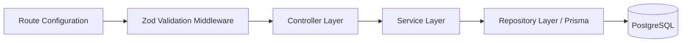

# System Architecture Design - TransitOps

This document details the software architecture patterns, data flow conventions, and engineering standards for TransitOps.

---

## 1. Monorepo Organization

TransitOps uses npm workspaces to coordinate development across packages, optimizing code-sharing and deployment.

```
TransitOps/
├── apps/
│   ├── frontend/         # Flutter application
│   └── backend/          # Node.js + Express API
├── packages/
│   └── shared/           # Common utilities, constants, types
```

---

## 2. Frontend Architecture (Flutter)

The frontend implements **Clean Architecture** combined with **MVVM (Model-View-ViewModel)** for user interface logic.

```mermaid
graph TD
    subgraph Presentation Layer
        View[View / Widget] --> ViewModel[GetxController / ViewModel]
    end

    subgraph Domain Layer (Pure Dart)
        ViewModel --> Usecase[Usecase]
        Usecase --> RepositoryInterface[Repository Interface]
        Entity[Entity]
    end

    subgraph Data Layer
        RepositoryInterface <|-- RepositoryImpl[Repository Implementation]
        RepositoryImpl --> RemoteDataSource[Remote Data Source / Dio]
        RepositoryImpl --> LocalDataSource[Local Data Source / Storage]
        Model[Model / JSON serialization]
    end
```

### Presentation Layer
- **Views**: Flutter layouts (`StatelessWidget` or `GetView<T>`). Contain no state validation or business logic. All interactions route to ViewModels.
- **ViewModels (GetxControllers)**: Coordinate View state, trigger validation, and trigger usecases.
- **GetX Bindings**: Declare injection of Controllers and Services, resolving dependencies on navigation routes.

### Domain Layer
- **Entities**: Simple, plain Dart models with no framework-specific decorators or methods.
- **Usecases**: Logic executors representing a single user action (e.g. `AuthorizeUser`, `ReportDelay`).
- **Repository Interfaces**: Abstract definitions representing data storage capabilities.

### Data Layer
- **Models**: Extend Entities, providing `fromJson` and `toJson` methods for network operations.
- **Data Sources**: Abstract communication with network APIs (via Dio client) or local databases.
- **Repository Implementations**: Implement abstract interfaces defined in the Domain layer, handling caching policies.

---

## 3. Backend Architecture (Node.js/Express)

The API is built on a **Modular Feature-based Architecture** with strict Separation of Concerns.



### Route Layer (`*.routes.ts`)
- Maps HTTP paths to Controllers.
- Attaches validators and authentication guards.

### Validator Layer (`*.validator.ts`)
- Leverages `zod` to inspect `req.body`, `req.query`, and `req.params`.
- Returns standardized `400 Bad Request` payloads with detailed error summaries if schema parsing fails.

### Controller Layer (`*.controller.ts`)
- Parses request headers/params, maps arguments to service calls, and returns JSON payloads with corresponding HTTP codes.
- **No business logic or database queries are allowed here.**

### Service Layer (`*.service.ts`)
- Orchestrates transaction boundaries, business algorithms, authorization rules, and external API requests.

### Repository Layer (`*.repository.ts`)
- Leverages `PrismaClient` to read/write records from the PostgreSQL database.

---

## 4. Verification & Linting Guidelines

To maintain clean code formatting and linting:
- **TypeScript (Backend & Shared)**: Checked with ESLint rules (no explicit `any` and no unused variables).
- **Dart (Frontend)**: Standard Flutter styling checks configured in `analysis_options.yaml`.
- **Prettier**: Enforces consistent code styling.
